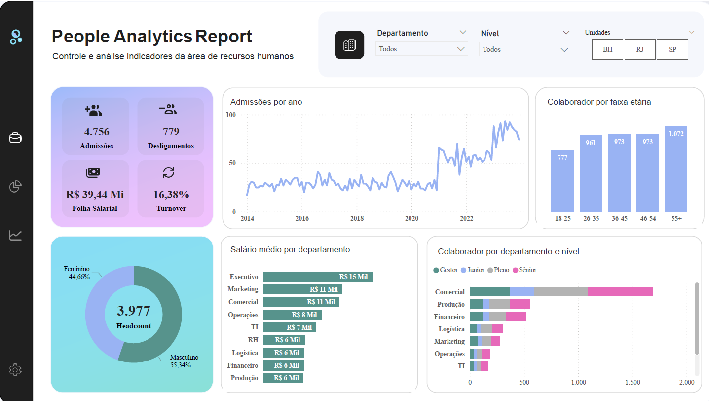

# Projeto de RH em Power BI

Este projeto criar um dashboard de Recursos Humanos utilizando o Power BI.
Vamos cobrir desde a importação e transformação dos dados até a criação de
visualizações interativas que ajudam a monitorar indicadores chave de RH,
como recrutamento, retenção e desempenho dos colaboradores. Este curso é ideal
para profissionais de RH, analistas de dados e gestores que desejam aperfeiçoar
suas habilidades em análise de dados e Business Intelligence.

## Importar Dados

Importe dados da pasta Dados que conte as seguintes tabelas:

1. :arrow_right:Comercial_Departamento
2. :arrow_right:Executivo_Departamento
3. :arrow_right:Financeiro_Departamento
4. :arrow_right:Logística_Departamento
5. :arrow_right:Marketing_Departamento
6. :arrow_right:Operações_Departamento
7. :arrow_right:Produção_Departamento
8. :arrow_right:RH_Departamento
9. :arrow_right:TI_Departamento

### Código de importação de Dados

Param font :arrow_right:caminho_fonte={caminha independente da maquina usada}

```powerquery
let
    Fonte = Folder.Files(caminho_fonte),
    tb_dados_excel = Table.AddColumn(Fonte, "Dados_TB", each Excel.Workbook([Content])),
    #"Outras Colunas Removidas" = Table.SelectColumns(tb_dados_excel, {"Dados_TB"}),
    #"Dados_TB Expandido" = Table.ExpandTableColumn(
        #"Outras Colunas Removidas", "Dados_TB", {"Data"}, {"Dados_TB.Data"}
    ),
    #"Dados_TB.Data Expandido" = Table.ExpandTableColumn(
        #"Dados_TB Expandido",
        "Dados_TB.Data",
        {
            "Column1",
            "Column2",
            "Column3",
            "Column4",
            "Column5",
            "Column6",
            "Column7",
            "Column8",
            "Column9",
            "Column10",
            "Column11",
            "Column12",
            "Column13"
        },
        {
            "Column1",
            "Column2",
            "Column3",
            "Column4",
            "Column5",
            "Column6",
            "Column7",
            "Column8",
            "Column9",
            "Column10",
            "Column11",
            "Column12",
            "Column13"
        }
    ),
    #"Cabeçalhos Promovidos" = Table.PromoteHeaders(#"Dados_TB.Data Expandido", [PromoteAllScalars = true]),
    #"Linhas Filtradas" = Table.SelectRows(#"Cabeçalhos Promovidos", each [Colaborador] <> "Colaborador"),
    #"Tipo Alterado" = Table.TransformColumnTypes(
        #"Linhas Filtradas",
        {
            {"Colaborador", type text},
            {"Data Admissão", type date},
            {"Gênero", type text},
            {"Idade", Int64.Type},
            {"Faixa Etária", type text},
            {"Etnia", type text},
            {"Unidade", type text},
            {"Departamento", type text},
            {"Salário", Currency.Type},
            {"Nível", type text},
            {"Desligado", type text},
            {"Data Desligamento", type date},
            {"Motivo", type text}
        }
    )
in
    #"Tipo Alterado"
```

Este script em linguagem M (Power Query) realiza um processo de **ETL
(Extração, Transformação e Carga)**.
Seu objetivo principal é automatizar a consolidação de múltiplos arquivos Excel,
que possuem a mesma estrutura, a partir de uma única pasta.

O processo transforma os dados brutos de vários arquivos em uma tabela única,
limpa e pronta para análise.

### Etapas do Processo

1. **Extração (Extraction)**
    * O script se conecta a uma pasta de origem (`caminho_fonte`) e lê todos os
    * arquivos contidos nela.

2. **Transformação (Transformation)**
    * **Leitura e Combinação:** Acessa o conteúdo de cada arquivo Excel, extrai
    * os dados de suas planilhas e empilha todas as tabelas para formar um
    * conjunto de dados único.
    * **Limpeza e Estruturação:**
        * Promove a primeira linha como cabeçalho da nova tabela
        * (ex: "Colaborador", "Data Admissão", "Salário").
        * Remove linhas de cabeçalho duplicadas que foram
        * importadas dos arquivos subsequentes.
    * **Formatação de Tipos:** Ajusta o tipo de dado de cada coluna para
    * garantir a consistência e a correta utilização em cálculos e
    * visualizações (ex: `Data Admissão` para **Data**, `Salário`
    * para **Moeda**, `Idade` para **Número Inteiro**).
  
### Medidas Usadas

1. :arrow_right: Total de Admissões

```dax
Admissoes = COUNTAX('Funcionários','Funcionários'[Colaborador])

```

Esta fórmula cria uma medida chamada Admissoes que conta o número total de
funcionários.
Ela funciona da seguinte maneira:
Percorre a tabela `Funcionários`, linha por linha.
Para cada linha, verifica se a coluna `[Colaborador]` não está vazia.
O resultado final é o número de linhas que possuem um nome de colaborador
preenchido.
Em essência, é uma forma de contar o total de funcionários na sua base de dados.

2. :arrow_right: Total de Desligamento

```dax
Desligamentos = CALCULATE([Admissoes],'Funcionários'[Desligado]IN{"Sim"})
```

Esta fórmula cria uma medida que calcula o número total de funcionários que
foram desligados.
Ela reutiliza a medida `[Admissoes]` (que conta todos os funcionários) e
aplica um filtro para contar apenas aqueles marcados como `"Sim"` na coluna
`[Desligado]`.

3. :arrow_right: Percentual de Turnover

```dax
Turnover = DIVIDE([Desligamentos],[Admissoes],0)
```

Esta fórmula cria uma medida chamada `Turnover` que calcula a taxa de
rotatividade (turnover) de funcionários.
Ela faz isso dividindo o número de `desligamentos` pelo número total de
`admissões`.
O 0 no final é uma proteção para evitar erros de divisão por zero,
retornando 0 caso não haja nenhuma admissão para calcular.

O turnover é um indicador (geralmente uma porcentagem) que mede a taxa com que
os funcionários deixam uma empresa em um determinado período.

turnover ⚓  Desligamentos / Admissoes

4. :arrow_right: Total Folha

```dax
Folha Salarial = SUMX('Funcionários','Funcionários'[Salário])
```

Esta fórmula cria uma medida chamada `Folha Salarial` que calcula o custo
total da folha de pagamento.
Ela faz isso percorrendo a tabela `'Funcionários'`, linha por linha, e somando o
valor encontrado na coluna `[Salário]` de cada funcionário.

5. :arrow_right: Headcount

```dax
Headcount = CALCULATE([Admissoes],NOT('Funcionários'[Desligado]IN{"Sim"}))

```

Esta fórmula cria uma medida chamada `Headcount` que calcula o número de
funcionários ativos na empresa.
Ela funciona pegando o número total de admissões `([Admissoes])` e aplicando um
filtro para excluir todos os funcionários que foram desligados.

6. :arrow_right: Salário Médio

```dax
Salario Medio = AVERAGEX('Funcionários','Funcionários'[Salário])
```

Esta fórmula cria uma medida chamada Salario Medio que calcula o salário médio
de todos os funcionários.
Ela funciona percorrendo a tabela 'Funcionários', linha por linha, e depois
 calcula a média de todos os valores encontrados na coluna `[Salário]`.

imagem do resultado final

 .
